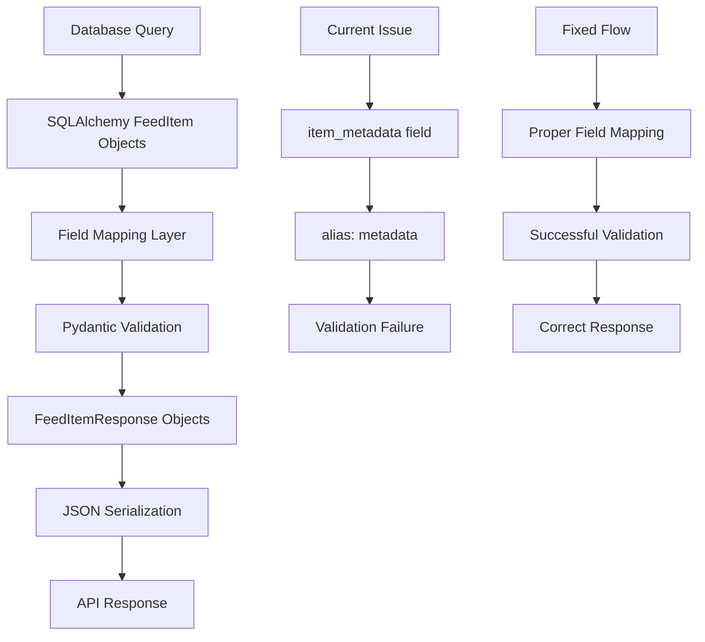

# Design Document: Fix Feed Metadata Validation

## Overview

This design addresses a critical validation error in the feed API where `FeedItemResponse.model_validate()` fails when processing SQLAlchemy `FeedItem` objects. The error occurs because of a field mapping mismatch between the SQLAlchemy model's `item_metadata` field and the Pydantic schema's expected field structure.

The core issue is that the current implementation relies on Pydantic's automatic field mapping from SQLAlchemy objects, but the field names and aliases are not properly aligned, causing validation to fail when the metadata field is processed.

## Architecture

The fix involves three main components:

1. **Field Mapping Correction**: Ensure proper alignment between SQLAlchemy model fields and Pydantic schema fields
2. **Validation Configuration**: Configure Pydantic models to correctly handle SQLAlchemy object validation
3. **Serialization Pipeline**: Implement proper data transformation from database objects to API responses



## Components and Interfaces

### 1. SQLAlchemy Model (FeedItem)

- **Current State**: Has `item_metadata` field mapped to database column `metadata`
- **Issue**: Field name doesn't align with Pydantic expectations
- **Solution**: Ensure field mapping is explicit and compatible

### 2. Pydantic Schema (FeedItemResponse)

- **Current State**: Has `item_metadata` field with `alias="metadata"`
- **Issue**: Alias configuration not working correctly with `model_validate()`
- **Solution**: Fix field configuration and validation setup

### 3. API Route Handler

- **Current State**: Uses `FeedItemResponse.model_validate(item)` directly
- **Issue**: No explicit field mapping or data transformation
- **Solution**: Implement proper object-to-dict conversion or fix model configuration

## Data Models

### Current SQLAlchemy Model Structure

```python
class FeedItem(Base, CreatedAtMixin):
    __tablename__ = "feed_items"

    id: Mapped[str] = mapped_column(String, primary_key=True)
    # ... other fields ...
    item_metadata: Mapped[Optional[Dict[str, Any]]] = mapped_column(
        JSONType, name="metadata"
    )
```

### Current Pydantic Schema Structure

```python
class FeedItemResponse(FeedItemBase, ...):
    id: str = Field(..., description="Feed item ID")
    item_metadata: Optional[Dict[str, Any]] = Field(
        None, alias="metadata", description="Additional metadata"
    )
    # ... other fields ...

    model_config = ConfigDict(from_attributes=True, ...)
```

### Root Cause Analysis

The issue occurs because:

1. SQLAlchemy model has field `item_metadata`
2. Pydantic schema has field `item_metadata` with alias `metadata`
3. When `model_validate()` is called with `from_attributes=True`, Pydantic tries to map fields by name
4. The alias system doesn't work as expected during validation from SQLAlchemy objects
5. This causes a type mismatch where Pydantic receives unexpected data types

## Solution Approaches

### Approach 1: Fix Field Mapping (Recommended)

- Align field names between SQLAlchemy model and Pydantic schema
- Use consistent naming without relying on aliases for internal field mapping
- Maintain API compatibility through proper alias configuration

### Approach 2: Explicit Data Transformation

- Convert SQLAlchemy objects to dictionaries before validation
- Ensure proper field name mapping during conversion
- More explicit but requires additional transformation step

### Approach 3: Custom Validation Logic

- Implement custom validation methods in Pydantic schema
- Handle SQLAlchemy object conversion explicitly
- More complex but provides full control over the process

## Correctness Properties

_A property is a characteristic or behavior that should hold true across all valid executions of a system—essentially, a formal statement about what the system should do. Properties serve as the bridge between human-readable specifications and machine-verifiable correctness guarantees._

Based on the prework analysis and property reflection, the following properties ensure the metadata validation fix works correctly:

### Property 1: Metadata Validation Success

_For any_ feed item retrieved from the database, the FeedItemResponse validation should succeed without raising validation errors, regardless of the metadata content structure.
**Validates: Requirements 1.1, 1.4**

### Property 2: Dictionary Structure Preservation

_For any_ feed item with metadata stored as a dictionary (including nested structures), the validated FeedItemResponse should preserve the exact dictionary structure and content without type conversion errors.
**Validates: Requirements 1.2, 2.1, 2.3**

### Property 3: Type Consistency

_For any_ validated FeedItemResponse object, all fields should contain only standard Python types (no SQLAlchemy-specific objects), and the metadata field should maintain its Dict[str, Any] type throughout the validation pipeline.
**Validates: Requirements 2.2, 2.4**

### Property 4: Round-trip Consistency

_For any_ feed item created via the POST endpoint, retrieving that item via the GET endpoint should return a valid FeedItemResponse with identical metadata content.
**Validates: Requirements 3.2**

### Property 5: Backward Compatibility

_For any_ existing feed item in the database, the API response format and metadata accessibility should remain identical to the pre-fix behavior, ensuring no breaking changes for client applications.
**Validates: Requirements 5.1, 5.2, 5.3**

## Error Handling

The solution must handle several error scenarios gracefully:

### 1. Null Metadata Handling

- **Scenario**: Feed items with null/None metadata values
- **Handling**: Pydantic schema should accept None values and serialize them correctly
- **Implementation**: Ensure Optional typing is properly configured

### 2. Invalid JSON in Database

- **Scenario**: Corrupted or invalid JSON data in metadata column
- **Handling**: Provide clear error messages and prevent system crashes
- **Implementation**: Add validation at the database layer and handle JSONDecodeError

### 3. Type Mismatch Errors

- **Scenario**: Metadata field contains unexpected data types
- **Handling**: Convert or reject with descriptive error messages
- **Implementation**: Use Pydantic validators to handle type coercion

### 4. Large Metadata Objects

- **Scenario**: Very large metadata dictionaries that could impact performance
- **Handling**: Set reasonable size limits and provide warnings
- **Implementation**: Add field validators for size constraints

## Testing Strategy

The testing approach combines unit tests for specific scenarios with property-based tests for comprehensive coverage:

### Unit Testing Focus

- **Null metadata edge case**: Verify graceful handling of None values
- **Empty dictionary handling**: Test with `{}` metadata
- **Integration points**: Test each API endpoint individually
- **Error conditions**: Test invalid JSON, oversized metadata, type mismatches

### Property-Based Testing Configuration

- **Library**: Use `hypothesis` for Python property-based testing
- **Iterations**: Minimum 100 iterations per property test
- **Data Generation**: Generate diverse metadata structures including:
  - Nested dictionaries of varying depth
  - Mixed data types (strings, numbers, booleans, lists)
  - Edge cases (empty dicts, very large objects)
  - Unicode and special characters

### Property Test Implementation

Each correctness property will be implemented as a separate property-based test:

1. **Property 1 Test**: Generate random feed items, validate they don't raise exceptions
   - **Tag**: Feature: fix-feed-metadata-validation, Property 1: Metadata Validation Success

2. **Property 2 Test**: Generate feed items with complex metadata, verify structure preservation
   - **Tag**: Feature: fix-feed-metadata-validation, Property 2: Dictionary Structure Preservation

3. **Property 3 Test**: Validate all response fields contain only standard Python types
   - **Tag**: Feature: fix-feed-metadata-validation, Property 3: Type Consistency

4. **Property 4 Test**: Create feed items, retrieve them, verify metadata consistency
   - **Tag**: Feature: fix-feed-metadata-validation, Property 4: Round-trip Consistency

5. **Property 5 Test**: Compare response formats before and after fix
   - **Tag**: Feature: fix-feed-metadata-validation, Property 5: Backward Compatibility

### Integration Testing

- **End-to-end flow**: Test complete request/response cycle
- **Database interaction**: Verify proper JSON serialization/deserialization
- **API contract**: Ensure response schemas match OpenAPI specifications
- **Performance**: Verify fix doesn't introduce performance regressions
