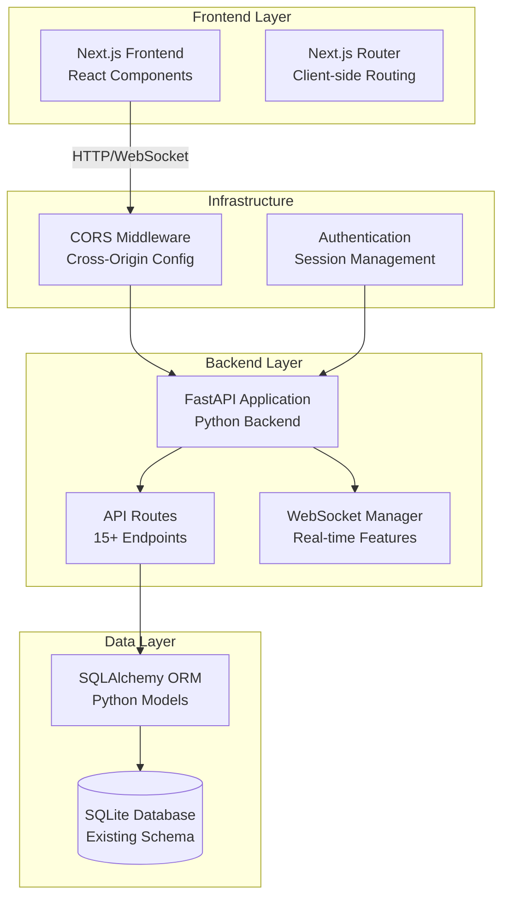
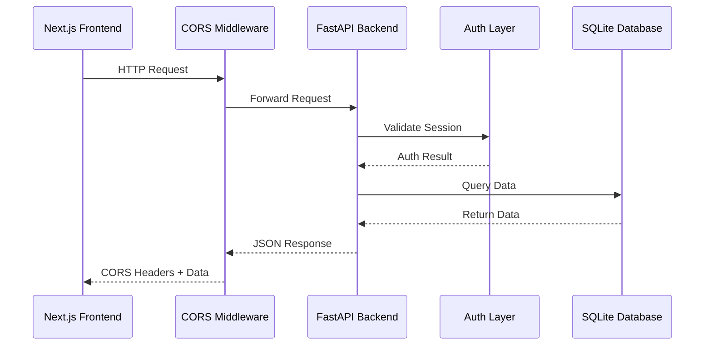

# Design Document: Backend Migration to FastAPI

## Overview

This design outlines the migration of a Next.js full-stack application's backend API layer to FastAPI while maintaining the Next.js frontend. The migration involves extracting 15+ API endpoints from Next.js API routes (`app/api/`) to a standalone FastAPI backend, ensuring all existing functionality is preserved while establishing proper separation of concerns.

The migration strategy focuses on maintaining identical API contracts, preserving data integrity, and ensuring seamless frontend-backend communication through proper CORS configuration and authentication handling.

## Architecture

### High-Level Architecture



### Component Interaction Flow



## Components and Interfaces

### 1. FastAPI Application Structure

**Core Application (`main.py`)**

- FastAPI application instance with middleware configuration
- CORS middleware for frontend communication
- Authentication middleware for session validation
- Exception handlers for consistent error responses
- Startup/shutdown event handlers for database connections

**Router Organization**

- Modular router structure mirroring existing API endpoints
- Separate routers for: alerts, cases, feed, search, uploads, trending, chat, events, export, inbox, predictions, pulse, shares
- Centralized router registration in main application

### 2. Database Integration Layer

**SQLAlchemy Models (`models/`)**

- Python equivalents of existing Drizzle schema definitions
- Proper relationships and constraints matching current database
- Support for JSON fields in metadata columns
- Enum definitions for status fields and categories

**Database Connection Management**

- Async SQLAlchemy engine for improved performance
- Connection pooling configuration
- Database session dependency injection
- Proper connection lifecycle management

### 3. Pydantic Schemas

**Request/Response Models (`schemas/`)**

- Input validation schemas for all API endpoints
- Response serialization models with proper typing
- Nested models for complex data structures
- Custom validators for business logic constraints

**Schema Categories:**

- `AlertSchemas`: Alert creation, updates, and responses
- `CaseSchemas`: Case management and filtering
- `FeedSchemas`: Feed item structures and pagination
- `SearchSchemas`: Search queries and result formatting
- `UploadSchemas`: File upload and processing status
- `UserSchemas`: User authentication and profile data

### 4. Authentication and Authorization

**Session Management**

- JWT token validation or session cookie handling
- User context extraction from requests
- Role-based access control implementation
- Integration with existing authentication system

**Security Middleware**

- Request authentication validation
- User permission checking
- Rate limiting for API endpoints
- Input sanitization and validation

### 5. Real-Time Features (WebSocket)

**WebSocket Connection Manager**

- Connection lifecycle management (connect/disconnect)
- Client connection registry and broadcasting
- Message routing based on user permissions
- Reconnection handling and error recovery

**Real-Time Event Types**

- Alert notifications for new/updated alerts
- Case status updates and assignments
- Feed item updates and new content
- System status and maintenance notifications

### 6. File Upload System

**Upload Processing Pipeline**

- Multipart file handling with size/type validation
- Asynchronous file processing for large uploads
- Progress tracking and status updates
- Error handling and partial upload recovery

**Upload Status Management**

- Database tracking of upload progress
- Real-time status updates via WebSocket
- Batch processing coordination
- File validation and content parsing

## Data Models

### SQLAlchemy Model Definitions

**Core Models (matching existing schema):**

```python
# User Model
class User(Base):
    __tablename__ = "users"
    id: Mapped[str] = mapped_column(String, primary_key=True)
    name: Mapped[str] = mapped_column(String, nullable=False)
    email: Mapped[str] = mapped_column(String, nullable=False)
    role: Mapped[UserRole] = mapped_column(Enum(UserRole), nullable=False)
    business_unit: Mapped[Optional[str]] = mapped_column(String)
    avatar_url: Mapped[Optional[str]] = mapped_column(String)
    created_at: Mapped[str] = mapped_column(String, nullable=False)

# Case Model
class Case(Base):
    __tablename__ = "cases"
    id: Mapped[str] = mapped_column(String, primary_key=True)
    case_number: Mapped[str] = mapped_column(String, nullable=False, unique=True)
    channel: Mapped[Channel] = mapped_column(Enum(Channel), nullable=False)
    status: Mapped[CaseStatus] = mapped_column(Enum(CaseStatus), nullable=False)
    category: Mapped[str] = mapped_column(String, nullable=False)
    subcategory: Mapped[Optional[str]] = mapped_column(String)
    sentiment: Mapped[Sentiment] = mapped_column(Enum(Sentiment), nullable=False)
    severity: Mapped[Severity] = mapped_column(Enum(Severity), nullable=False)
    risk_flag: Mapped[bool] = mapped_column(Boolean, default=False)
    needs_review_flag: Mapped[bool] = mapped_column(Boolean, default=False)
    business_unit: Mapped[str] = mapped_column(String, nullable=False)
    summary: Mapped[str] = mapped_column(String, nullable=False)
    customer_name: Mapped[Optional[str]] = mapped_column(String)
    agent_id: Mapped[Optional[str]] = mapped_column(String)
    assigned_to: Mapped[Optional[str]] = mapped_column(String)
    created_at: Mapped[str] = mapped_column(String, nullable=False)
    updated_at: Mapped[str] = mapped_column(String, nullable=False)
    resolved_at: Mapped[Optional[str]] = mapped_column(String)
    upload_id: Mapped[Optional[str]] = mapped_column(String)
```

**Relationship Definitions:**

- User-to-Share relationships (sender/recipient)
- Case-to-Upload relationships for batch imports
- Alert-to-FeedItem relationships for notifications
- Proper foreign key constraints and cascading rules

### JSON Field Handling

**Metadata Fields:**

- Custom SQLAlchemy types for JSON serialization/deserialization
- Pydantic models for JSON field validation
- Type-safe access to nested JSON properties
- Migration-compatible JSON structure preservation

## Error Handling

### Exception Hierarchy

**Custom Exception Classes:**

- `DatabaseError`: Database connection and query failures
- `ValidationError`: Input validation and business rule violations
- `AuthenticationError`: Authentication and authorization failures
- `NotFoundError`: Resource not found scenarios
- `ConflictError`: Data conflicts and constraint violations

**Global Exception Handlers:**

- Consistent error response format across all endpoints
- Proper HTTP status code mapping
- Error logging and monitoring integration
- Development vs. production error detail levels

### Error Response Format

```python
{
    "error": {
        "code": "VALIDATION_ERROR",
        "message": "Invalid input data",
        "details": {
            "field": "email",
            "issue": "Invalid email format"
        },
        "timestamp": "2024-01-15T10:30:00Z"
    }
}
```

## Testing Strategy

### Unit Testing Approach

**Test Coverage Areas:**

- Individual endpoint logic and business rules
- Database model operations and relationships
- Pydantic schema validation and serialization
- Authentication and authorization mechanisms
- File upload processing and validation
- WebSocket connection management

### Testing Tools

- `pytest` as the primary testing framework
- `pytest-asyncio` for async endpoint testing
- `httpx` for API client testing
- `pytest-mock` for dependency mocking
- `factory-boy` for test data generation

**Windows Command Examples:**

```cmd
REM Activate conda environment and run all tests
conda activate fastapi-backend & python -m pytest tests/ -v

REM Run with coverage
conda activate fastapi-backend & python -m pytest tests/ --cov=app --cov-report=html

REM Run property-based tests
conda activate fastapi-backend & python -m pytest tests/test_property_*.py -v -s
```

### Property-Based Testing

Property-based tests will validate universal correctness properties using the `hypothesis` library with minimum 100 iterations per test. Each test will be tagged with the format: **Feature: backend-migration-fastapi, Property {number}: {property_text}**

### Integration Testing

**End-to-End Test Scenarios:**

- Complete request-response cycles for all endpoints
- Database transaction integrity across operations
- WebSocket connection and message broadcasting
- File upload processing from start to finish
- Authentication flow and session management
- CORS configuration and cross-origin requests

**Test Environment Setup:**

- Isolated test database with schema migration
- Mock external dependencies and services
- Containerized testing environment for consistency
- Automated test data seeding and cleanup

**Windows Development Commands:**

```cmd
REM Setup conda environment
conda create -n fastapi-backend python=3.12 -y
conda activate fastapi-backend & pip install -r requirements.txt

REM Start development server
conda activate fastapi-backend & python main.py

REM Run tests
conda activate fastapi-backend & python -m pytest tests/ -v

REM Code quality checks
conda activate fastapi-backend & python -m black app\ tests\
conda activate fastapi-backend & python -m isort app\ tests\
conda activate fastapi-backend & python -m flake8 app\ tests\
```

## Correctness Properties

_A property is a characteristic or behavior that should hold true across all valid executions of a system—essentially, a formal statement about what the system should do. Properties serve as the bridge between human-readable specifications and machine-verifiable correctness guarantees._

Based on the requirements analysis, the following correctness properties ensure the FastAPI backend maintains identical functionality to the original Next.js API:

### Property 1: API Response Format Consistency

_For any_ valid API request that worked in the original Next.js system, the FastAPI backend should return a response with identical structure, data types, and content format
**Validates: Requirements 1.2, 3.2, 4.2**

### Property 2: HTTP Method Support Preservation

_For any_ API endpoint, the FastAPI backend should accept exactly the same HTTP methods (GET, POST, PUT, DELETE) as the original Next.js implementation and reject unsupported methods with appropriate error codes
**Validates: Requirements 1.3**

### Property 3: Database Operation Equivalence

_For any_ database operation (create, read, update, delete), the FastAPI backend should produce identical results and side effects as the original Next.js system when given the same input data
**Validates: Requirements 2.2, 2.4, 8.1, 8.2, 8.3**

### Property 4: URL Structure and Parameter Preservation

_For any_ API endpoint with parameters (path parameters, query parameters, request body), the FastAPI backend should handle them identically to the original system, including nested routes and parameter validation
**Validates: Requirements 1.5, 3.5, 6.3**

### Property 5: Authentication and Authorization Consistency

_For any_ request with authentication credentials, the FastAPI backend should make identical access control decisions as the original system, accepting valid credentials and rejecting invalid ones with the same error responses
**Validates: Requirements 3.3, 7.1, 7.2, 7.5**

### Property 6: Database Relationship and Constraint Enforcement

_For any_ database operation that involves relationships or constraints, the FastAPI backend should enforce the same rules and produce the same validation errors as the original system
**Validates: Requirements 2.3, 8.3**

### Property 7: WebSocket Message Broadcasting

_For any_ WebSocket event that should be broadcast to multiple clients, all connected and authorized clients should receive the message with identical content and timing
**Validates: Requirements 4.3**

### Property 8: File Upload Processing Consistency

_For any_ file upload operation, the FastAPI backend should apply the same validation rules, processing logic, and status updates as the original system
**Validates: Requirements 5.1, 5.2, 5.4, 5.5**

### Property 9: Search Result Consistency

_For any_ search query, the FastAPI backend should return results in the same order with identical ranking, filtering, and metadata as the original system
**Validates: Requirements 6.1, 6.5**

### Property 10: Search Analytics Tracking

_For any_ search operation performed, the FastAPI backend should create analytics records in the database with the same structure and content as the original system
**Validates: Requirements 6.2**

### Property 11: Role-Based Access Control

_For any_ user with a specific role (admin, bu_manager, supervisor), the FastAPI backend should grant or deny access to endpoints using identical authorization rules as the original system
**Validates: Requirements 7.3**

### Property 12: Session State Management

_For any_ user session operation (login, logout, session validation), the FastAPI backend should maintain session state identically to the original system
**Validates: Requirements 7.4**

### Property 13: Input Validation Error Consistency

_For any_ invalid input data, the FastAPI backend should return validation errors with the same structure, error codes, and messages as the original system
**Validates: Requirements 8.4, 8.5**

### Property 14: WebSocket Connection Lifecycle

_For any_ WebSocket connection attempt, the FastAPI backend should handle connection establishment, maintenance, and termination with the same behavior as the original system
**Validates: Requirements 4.4**

### Property 15: Configuration Environment Handling

_For any_ environment configuration (development, staging, production), the FastAPI backend should load and apply configuration values correctly and fail appropriately for invalid configurations
**Validates: Requirements 11.2, 11.5**

### Property 16: Caching Behavior Consistency

_For any_ cacheable data request, the FastAPI backend should return cached data when appropriate and fresh data when cache is invalid, maintaining the same caching logic as the original system
**Validates: Requirements 9.4**

### Property 17: Logging Format Consistency

_For any_ loggable event, the FastAPI backend should produce log entries with the same format, level, and content as the original system
**Validates: Requirements 11.4**

### Property 18: API Documentation Completeness

_For any_ implemented API endpoint, the generated OpenAPI documentation should include complete request/response schemas, examples, and parameter descriptions
**Validates: Requirements 12.2, 12.5**
