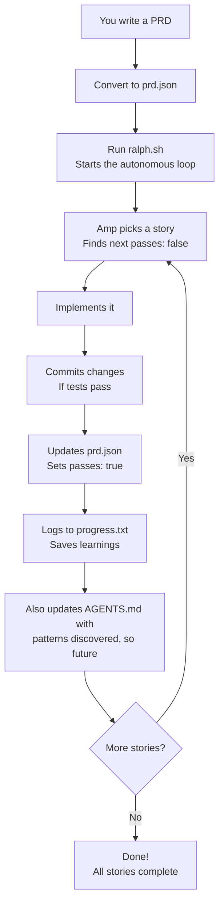
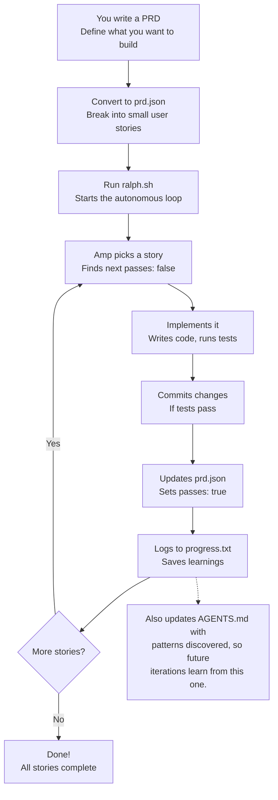

1/19/26, 3:21 PM (6) Step-by-step guide to get Ralph working and shipping code | LinkedIn
in [Search] Home My Network Jobs Messaging Notifications (6) Me For Business Advertise


# Step-by-step guide to get Ralph working and shipping code


**Ryan Carson** [Verified]
Founder & Developer. Built and sold 3 startups

January 8, 2026

Everyone is raving about Ralph. What is it?

Ralph is an autonomous AI coding loop that ships features while you sleep.

Created by @GeoffreyHuntley and announced in his original post, it runs Amp (or your agent of choice) repeatedly until all tasks are complete.

Each iteration is a fresh context window (keeping Threads nice and small). Memory persists via git history and text files.

---

## How Ralph Works with Amp
**Autonomous AI agent loop for completing PRDs**




**Step 10 of 10**
Click Next to reveal each step
[ Previous ] [ Next ] [ Reset ]


https://www.linkedin.com/pulse/step-by-step-guide-get-ralph-working-shipping-code-ryan-carson-qnlnc/?trackingId=XXUu3Z7SR7edhYZXxniLDg%3D… 1/10

1/19/26, 3:21 PM (6) Step-by-step guide to get Ralph working and shipping code | LinkedIn




How the Ralph system works

# How It Works

A bash loop that:

1. Pipes a prompt into your AI agent
2. Agent picks the next story from prd.json
3. Agent implements it
4. Agent runs typecheck + tests
5. Agent commits if passing
6. Agent marks story done
7. Agent logs learnings
8. Loop repeats until done

## Memory persists only through:

* Git commits
* progress.txt (learnings)
* prd.json (task status)

## File Structure

```text
scripts/ralph/
├── ralph.sh
├── prompt.md
├── prd.json
└── progress.txt
```

## ralph.sh

The loop:


https://www.linkedin.com/pulse/step-by-step-guide-get-ralph-working-shipping-code-ryan-carson-qnlnc/?trackingId=XXUu3Z7SR7edhYZXxniLDg%3D… 2/10

1/19/26, 3:21 PM (6) Step-by-step guide to get Ralph working and shipping code | LinkedIn


```bash
#!/bin/bash
set -e

MAX_ITERATIONS=${1:-10}
SCRIPT_DIR="$(cd "$(dirname \
 "${BASH_SOURCE[0]}")" && pwd)"

echo "🚀 Starting Ralph"

for i in $(seq 1 $MAX_ITERATIONS); do
 echo "═══ Iteration $i ═══"

 OUTPUT=$(cat "$SCRIPT_DIR/prompt.md" \
  | amp --dangerously-allow-all 2>&1 \
  | tee /dev/stderr) || true

 if echo "$OUTPUT" | \
  grep -q "<promise>COMPLETE</promise>"
 then
  echo "✅ Done!"
  exit 0
 fi

 sleep 2
done

echo "⚠ Max iterations reached"
exit 1
```

Make executable:

```bash
chmod +x scripts/ralph/ralph.sh
```

Other agents:

* Claude Code: `claude --dangerously-skip-permissions`

# prompt.md

Instructions for each iteration:

```markdown
# Ralph Agent Instructions

## Your Task

1. Read `scripts/ralph/prd.json`
2. Read `scripts/ralph/progress.txt`
(check Codebase Patterns first)
3. Check you're on the correct branch
4. Pick highest priority story
where `passes: false`
5. Implement that ONE story
```


https://www.linkedin.com/pulse/step-by-step-guide-get-ralph-working-shipping-code-ryan-carson-qnlnc/?trackingId=XXUu3Z7SR7edhYZXxniLDg%3D… 3/10

1/19/26, 3:21 PM (6) Step-by-step guide to get Ralph working and shipping code | LinkedIn


6. Run typecheck and tests
7. Update AGENTS.md files with learnings
8. Commit: `feat: [ID] - [Title]`
9. Update prd.json: `passes: true`
10. Append learnings to progress.txt

## Progress Format

APPEND to progress.txt:

## [Date] - [Story ID]
- What was implemented
- Files changed
- **Learnings:**
  - Patterns discovered
  - Gotchas encountered
---

## Codebase Patterns

Add reusable patterns to the TOP of progress.txt:

## Codebase Patterns
- Migrations: Use IF NOT EXISTS
- React: `useRef<Timeout | null>(null)`

## Stop Condition

If ALL stories pass, reply:
<promise>COMPLETE</promise>

Otherwise end normally.

## prd.json

Your task list:

```json
{
 "branchName": "ralph/feature",
 "userStories": [
  {
   "id": "US-001",
   "title": "Add login form",
   "acceptanceCriteria": [
    "Email/password fields",
    "Validates email format",
    "typecheck passes"
   ],
   "priority": 1,
   "passes": false,
   "notes": ""
  }
 ]
}
```


https://www.linkedin.com/pulse/step-by-step-guide-get-ralph-working-shipping-code-ryan-carson-qnlnc/?trackingId=XXUu3Z7SR7edhYZXxniLDg%3D... 4/10

1/19/26, 3:21 PM (6) Step-by-step guide to get Ralph working and shipping code | LinkedIn


Key fields:

* branchName — branch to use
* priority — lower = first
* passes — set true when done

## progress.txt

Start with context:

```markdown
# Ralph Progress Log
Started: 2024-01-15

## Codebase Patterns
- Migrations: IF NOT EXISTS
- Types: Export from actions.ts

## Key Files
- db/schema.ts
- app/auth/actions.ts
---
```

Ralph appends after each story.

Patterns accumulate across iterations.

## Running Ralph

```bash
./scripts/ralph/ralph.sh 25
```

Runs up to 25 iterations.

Ralph will:

* Create the feature branch
* Complete stories one by one
* Commit after each
* Stop when all pass

## Critical Success Factors

### 1. Small Stories

Must fit in one context window.

```markdown
❌ Too big:
> "Build entire auth system"
✅ Right size:
> "Add login form"
```


https://www.linkedin.com/pulse/step-by-step-guide-get-ralph-working-shipping-code-ryan-carson-qnlnc/?trackingId=XXUu3Z7SR7edhYZXxniLDg%3D… 5/10

1/19/26, 3:21 PM (6) Step-by-step guide to get Ralph working and shipping code | LinkedIn


```
> "Add email validation"
> "Add auth server action"
```

## 2. Feedback Loops

Ralph needs fast feedback:

* npm run typecheck
* npm test

Without these, broken code compounds.

## 3. Explicit Criteria

```
❌ Vague:
> "Users can log in"
✅ Explicit:
> - Email/password fields
> - Validates email format
> - Shows error on failure
> - typecheck passes
> - Verify at localhost:$PORT/login (PORT defaults to 3000)
```

## 4. Learnings Compound

By story 10, Ralph knows patterns from stories 1-9.

Two places for learnings:

1. **progress.txt** — session memory for Ralph iterations
2. **AGENTS.md**

Before committing, Ralph updates AGENTS.md files in directories with edited files if it discovered reusable patterns (gotchas, conventions, dependencies).

## 5. AGENTS.md Updates

Ralph updates AGENTS.md when it learns something worth preserving:

```
✅ Good additions:
- "When modifying X, also update Y"
- "This module uses pattern Z"
- "Tests require dev server running"
❌ Don't add:
- Story-specific details
- Temporary notes
- Info already in progress.txt
```


https://www.linkedin.com/pulse/step-by-step-guide-get-ralph-working-shipping-code-ryan-carson-qnlnc/?trackingId=XXUu3Z7SR7edhYZXxniLDg%3D… 6/10

1/19/26, 3:21 PM (6) Step-by-step guide to get Ralph working and shipping code | LinkedIn


# 6. Browser Testing

For UI changes, use the dev-browser skill by Sawyer Hood. Load it with Load the dev-browser skill, then:

```bash
# Start the browser server
~/.config/amp/skills/dev-browser/server.sh &
# Wait for "Ready" message

# Write scripts using heredocs
cd ~/.config/amp/skills/dev-browser && npx tsx <<'EOF'
import { connect, waitForPageLoad } from "@/client.js";

const client = await connect();
const page = await client.page("test");
await page.setViewportSize({ width: 1280, height: 900 });
const port = process.env.PORT || "3000";
await page.goto(`http://localhost:${port}/your-page`);
await waitForPageLoad(page);
await page.screenshot({ path: "tmp/screenshot.png" });
await client.disconnect();
EOF
```

Not complete until verified with screenshot.

## Common Gotchas

Idempotent migrations:

```sql
ADD COLUMN IF NOT EXISTS email TEXT;
```

Interactive prompts:

```bash
echo -e "\n\n\n" | npm run db:generate
```

Schema changes:

After editing schema, check:

* Server actions
* UI components
* API routes

Fixing related files is OK:

If typecheck requires other changes, make them. Not scope creep.

## Monitoring


https://www.linkedin.com/pulse/step-by-step-guide-get-ralph-working-shipping-code-ryan-carson-qnlnc/?trackingId=XXUu3Z7SR7edhYZXxniLDg%3D... 7/10

1/19/26, 3:21 PM (6) Step-by-step guide to get Ralph working and shipping code | LinkedIn


```bash
# Story status
cat scripts/ralph/prd.json | \
jq '.userStories[] | {id, passes}'
# Learnings
cat scripts/ralph/progress.txt
# Commits
git log --oneline -10
```

## Real Results

We built an evaluation system:

* 13 user stories
* ~15 iterations
* 2-5 min each
* ~1 hour total

Learnings compound. By story 10, Ralph knew our patterns.

## When NOT to Use

* Exploratory work
* Major refactors without criteria
* Security-critical code
* Anything needing human review

### Comments

68 · 18 comments · 5 reposts

[Like] [Comment] [Share]

<table>
  <thead>
    <tr>
        <th></th>
        <th>Add a comment...</th>
        <th>[emoji_icon]</th>
        <th>[image_icon]</th>
    </tr>
  </thead>
</table>

Most recent

**Totrakool Khongsap** [in] • You 3d
AI Specialist | Mathematician | Learn & Build | Write & Repeat

Thank you 🙏🙏🙏

Like Reply | 27 impressions

**Diego Mangabeira** [in] • 2nd 6d
TOP 1% LinkedIn Sales and Marketing Expert | Fractional Head of Sales fo...

Ralph sounds intriguing, but I wonder how it handles edge cases like design preferences. Using Figma or a design system as a reference could definitely help, but it seems like there’s still a gap to bridge. Curious to see how this evolves and what other tools might pop up in the meantir ...more

Like Reply · 1 reply

> **Matt Wood** [in] • 3rd+ 10h
> Founder, InSite | Design Intelligence Studio | We build brand syste...
>
> **Diego Mangabeira** - setup guardrails using Skills
>
> Like Reply


https://www.linkedin.com/pulse/step-by-step-guide-get-ralph-working-shipping-code-ryan-carson-qnlnc/?trackingId=XXUu3Z7SR7edhYZXxniLDg%3D... 8/10

1/19/26, 3:21 PM (6) Step-by-step guide to get Ralph working and shipping code | LinkedIn


> **Ran Shamay** [check] • 2nd 1w
> Principal Software Engineer at Microsoft
>
> Nice!
> What happens when the agent stuck on a loop? (In the same iteration) can it be bound to certain restrictions to overcome those issues? **Ryan Carson**
>
> Like · 2 | Reply · 1 reply
>
>> **Naor Tedgi** [check] • 2nd 1w
>> Principal Software Engineer - Backend and Data
>>
>> **Ran Shamay** no
>>
>> Like | Reply

> **Jasper Croome** ↖ • 3rd+ 1w
> Pushing tech boundaries to empower land owners
>
> Ralph is cool, but It (he?!) doesn't really account for taste - I _guess_ you could use either figma mcp or screenshots for examples to work towards? Or maybe just specify usage of the design system you have?
>
> Ok maybe Ralph's legit ...more
>
> Like | Reply · 2 replies
>
> See previous replies
>
>> **Matt Wood** [in] • 3rd+ 10h
>> Founder, InSite | Design Intelligence Studio | We build brand syste...
>>
>> **Ryan Carson** - I’m using Figma Desktop MCP, with Skills to sync Figma variables to my local Tailwind v4 CSS variablesc and it works well, if the Figma selections are baked into the PRD.json
>>
>> You can optionally add shadcn Registry using a Skill that only ...more
>>
>> Like | Reply

> **Brett Stark** [check] • 3rd+ 1w
> Program Director | ex-Motorola | Building AI Second Act & Vibe Build La...
>
> Bit surprised seems no v. popular repo for Ralph... perhaps there's other tools/systems out there. I need to investigate.
>
> Like | Reply

> **Brett Stark** [check] • 3rd+ 1w
> Program Director | ex-Motorola | Building AI Second Act & Vibe Build La...
>
> Thanks **Ryan Carson**. Interesting. At least relatively simple - Not sure if you've seen this yet, likely you have - but one of the most mind blowing things i've read in a while - https://steve-yegge.medium.com/welcome-to-gas-town-4f25ee16dd04. **Steve Yegge** ...more
>
> > 
> > **Welcome to Gas Town**
> > Happy New Year, and Welcome to Gas Town!
>
> Like | Reply · 1 reply
>
>> **Ryan Carson** [check] **Author** 1w
>> Founder & Developer. Built and sold 3 startups
>>
>> **Brett**, yes - Gas Town is fascinating. Lot's of innovation happening around this.
>>
>> Like | Reply

> **Majid Fekri** [in] • 2nd 1w
> Co-Founder & CTO @ Moorcheh.ai by Edge AI Innovations | Ph.D. in Scie...
>
> Interesting! I'd like to try it
>
> Like · 1 | Reply · 1 reply
>
>> **Ryan Carson** [check] **Author** 1w
>> Founder & Developer. Built and sold 3 startups
>>
>> **Majid Fekri** I've shipped two features today already - wild
>>
>> Like | Reply


https://www.linkedin.com/pulse/step-by-step-guide-get-ralph-working-shipping-code-ryan-carson-qnlnc/?trackingId=XXUu3Z7SR7edhYZXxniLDg%3D... 9/10

1/19/26, 3:21 PM (6) Step-by-step guide to get Ralph working and shipping code | LinkedIn


Like Reply

 **⚡ Daniel Frey** • 2nd (edited) 1w
I automate the work you hate.

⚠️‼️ Claude Code: `claude --dangerously-skip-permissions`

—

you better know what you are doing if you do this. ...more

Like Reply

 **Rasmus Widing** • 2nd 1w
Building Stuff With AI | rasmuswiding.com | Product Builder | AI Coding C...

Nice writeup, same principle many agentic engineers works is built on with some structure around the principles.

Like Reply

 **Max Sorto** • 3rd+ 1w
Payments & Stablecoins

💀

Like Reply

[ ] Load more comments

# Enjoyed this article?
Follow to never miss an update.


## Ryan Carson
Founder & Developer. Built and sold 3 startups

 Followed by Kasidis and Sarin

[+ Follow]


https://www.linkedin.com/pulse/step-by-step-guide-get-ralph-working-shipping-code-ryan-carson-qnlnc/?trackingId=XXUu3Z7SR7edhYZXxniLDg%3... 10/10